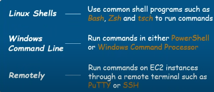

# AWS CLI

## Step 1

`Download  and install aws cli`--->`AWS CLI MIS installer`

Use any one of command line given below

-----

# IAM -->  List                 
| commands              |
|-----------------------|
| `aws iam list-users`  |
| `aws iam list-roles`  |
| `aws iam list-groups` |

